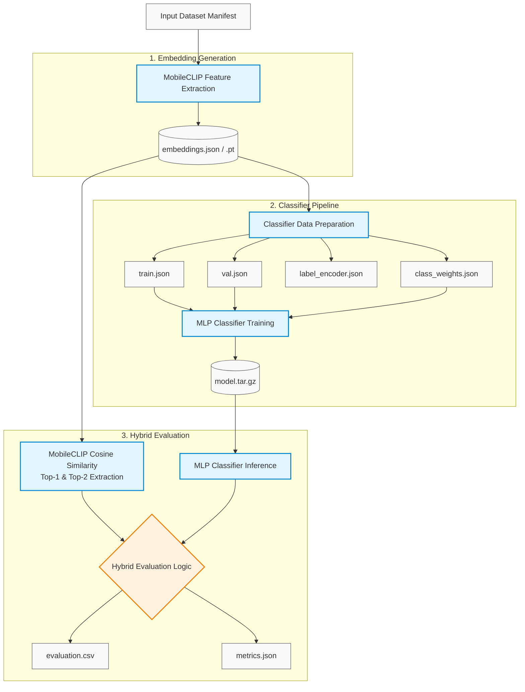
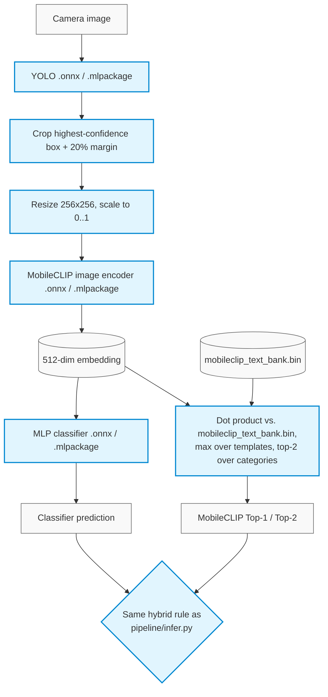

# FOD Pipeline

Foreign Object Debris (FOD) recognition pipeline built around YOLO, MobileCLIP,
and an MLP classifier. The pipeline is designed to run on AWS SageMaker using data stored in Amazon S3,
while also supporting single-image inference locally.

## Architecture

1. **Object Detection** - YOLO locates the foreign object and crops it with a 20% margin.
2. **Embedding Extraction** - MobileCLIP converts the cropped image into a 512-dimensional embedding. (Run once).
3. **MobileCLIP prediction** - The embedding is compared against text prompts to produce the Top-1 and Top-2 predictions.
4. **Classifier prediction** - The same embedding is passed through a trained MLP classifier.
5. **Hybrid prediction** - Combines MobileCLIP Top-1, MobileCLIP Top-2, and the MLP classifier prediction.

## Repository Structure

| Package | Purpose |
| :--- | :--- |
| `src/fod_pipeline/core/` | YOLO detection, MobileCLIP embedding, S3 utilities, label mapping |
| `src/fod_pipeline/data/` | FOD categories and MobileCLIP prompts |
| `src/fod_pipeline/classifier/` | MLP model, data preparation, training |
| `src/fod_pipeline/hybrid/` | Hybrid evaluation metrics |
| `src/fod_pipeline/pipeline/` | Pipeline orchestration |
| `src/fod_pipeline/sagemaker/` | SageMaker job launchers |
| `src/fod_pipeline/mobile/` | On-device export: converts YOLO/MobileCLIP/classifier to ONNX (Android) and Core ML (iOS) |

## Data Pipeline


## Installation

> **Prerequisites:** Python `>= 3.10`

### Step 1 — Clone the Repository

```bash
git clone https://github.com/TalaChehade4/fod-pipeline.git
cd fod-pipeline
```

### Step 2 — Install sagemaker version

```bash
pip install -e ".[sagemaker]"
```

## AWS Configuration

### Step 1 — Create the environment file

Copy `.env.example` to `.env` before using S3 utilities (`core/s3_io.py`) or launching SageMaker jobs (`sagemaker/`):

```bash
cp .env.example .env
```
### Step 2 — Configure environment variables

Open `.env` and set your AWS resources:
```bash
AWS_REGION=your-aws-region
SAGEMAKER_ROLE_ARN=arn:aws:iam::123456789012:role/service-role/AmazonSageMaker-ExecutionRole
S3_BUCKET=your-s3-bucket-name
S3_PROJECT_PREFIX=your-project-prefix
```
**Note:** These variables are loaded automatically across the pipeline. You only need to pass an explicit path flag if you want to override a default S3 location.

## Running the Pipeline on SageMaker
The complete pipeline is intended to run on AWS SageMaker.

### Step 1 — Upload model weights
> **Note:** This step only needs to be run **once** before launching training or evaluation pipelines.
They are currently saved at `s3://oreyeon-models/Tala-temp/fod-pipeline/weights/`.

```bash
fod-upload yolo_model.tar.gz --kind yolo-weights
fod-upload mobileclip_s0.pt --kind mobileclip-weights
```

### Step 2 — Upload datasets

> **Note:** This step only needs to be run **once** before launching training or evaluation pipelines.
Upload the required dataset manifests, database files, and join mappings used to construct the ground truth for MobileCLIP embeddings and the MLP classifier. They are currently saved at `s3://oreyeon-models/Tala-temp/fod-pipeline/manifests/`.

```bash
# --- 1. Dataset Manifests ---
# Saved automatically as 'train_manifest.json' (Classifier training data)
fod-upload train_manifest.manifest --kind manifest --split train in S3

# Saved automatically as 'test_manifest.json' (MobileCLIP & classifier evaluation data)
fod-upload test_manifest.manifest --kind manifest --split test

# --- 2. Database CSVs ---
# Saved automatically as 'trainingdata_old.csv' (Training FOD IDs & labels of the database)
fod-upload trainingdata_old.csv --kind database-csv --split train

# Saved automatically as 'testingdata_old.csv' (Testing FOD IDs & labels of the database)
fod-upload testingdata_old.csv --kind database-csv --split test

# Saved automatically as 'join_config.json' (Classes mapping for classifier only)
fod-upload join_config.json --kind join-config

# --- 3. MobileCLIP Mapping ---
# Saved automatically as 'mobileclip_category_mapping.json' (Maps MobileCLIP FOD categories to database class labels for alignment and accuracy evaluation)
fod-upload mobileclip_category_mapping.json --kind mobileclip-mapping
```

### Step 3 — Build label maps

> **Note:** This step only needs to be run **once** before launching training or evaluation pipelines.
Generate the required ground-truth label maps. They are currently saved at `s3://oreyeon-models/Tala-temp/fod-pipeline/manifests/`.

```bash
# Classifier ground truth (train split) - join-config checked first, database fallback. Saved automatically as `train_label_map.json`
fod-build-label-map --split train --ground-truth classifier

# Classifier ground truth (test split). Saved automatically as `test_label_map.json`
fod-build-label-map --split test --ground-truth classifier

# MobileCLIP ground truth (test split) - database only, no join-config. Saved automatically as `test_mobileclip_label_map.json`
fod-build-label-map --split test --ground-truth mobileclip
```

### Step 4 — Extract embeddings

> **Note:** This step only needs to be run **once** before launching training or evaluation pipelines unless new training or testing data is provided.
Generate MobileCLIP embeddings for the training and testing image datasets. Extracted embeddings are automatically saved in S3 at `s3://oreyeon-models/Tala-temp/fod-pipeline/embeddings/`.

```bash
# Extract embeddings for the training set
fod-sm-embed --split train

# Extract embeddings for the testing set
fod-sm-embed --split test
```

### Step 5 — Prepare classifier data

> **Note:** This step only needs to be run **once** before launching training or evaluation pipelines unless new training or testing data is provided or new classes were added.
Preprocesses the extracted embeddings to generate the following core artifacts: 

* **Train / Validation Split:** Randomly shuffles the training embeddings and splits them into **90% train** and **10% validation** sets (`train` and `val` embedding files).
* **Label Encoder:** Maps each FOD class label to a unique numerical index.
* **Class Weights:** Computes class distribution weights to handle class imbalance during loss calculation (weighted cross-entropy).

Saved automatically in S3 at `s3://oreyeon-models/Tala-temp/fod-pipeline/classifier-data/`.
```bash
fod-sm-prepare
```

### Step 6 — Train the classifier

```bash
fod-sm-train --epochs 100
```
After training, the latest model is automatically copied to `classifier-models/model.tar.gz` while previous training runs remain available under `classifier-results/<job-name>/`

### Step 7 — Evaluate the hybrid pipeline
Results are written to `s3://oreyeon-models/Tala-temp/fod-pipeline/hybrid-results/`.

The hybrid evaluation pipeline combines fine-grained predictions from **MobileCLIP** with broader predictions from the **MLP Classifier**.
Predictions are evaluated hierarchically across 3 levels to balance fine-grained precision with coarse-category fallback accuracy.

---

#### Evaluation Rules & Matching Logic

A prediction is evaluated in order and marked **CORRECT** if it satisfies any of the following conditions:

1. **MobileCLIP Fine Match:** MobileCLIP’s **Top-1** or **Top-2** prediction matches the fine-grained **MobileCLIP Ground Truth** *(e.g., predicted `Allen Key` = actual `Allen Key`)*.
2. **MobileCLIP Coarse Match:** MobileCLIP’s **Top-1** or **Top-2** prediction matches the broader **Classifier Ground Truth** *(e.g., MobileCLIP predicted `Metal Rod` for an `Allen Key` image)*.
3. **MLP Classifier Match:** The **MLP Classifier** output matches the broader **Classifier Ground Truth** *(e.g., the classifier predicted `Metal Rod` for an `Allen Key` image)*.

> **Why this 3-tier system works:**
> 
> MobileCLIP supports specific object categories (like *Allen Key*), whereas the MLP Classifier operates on broader groups (like *Metal Rod*). 
> 
> * **Preserving Precision:** If MobileCLIP successfully predicts *Allen Key*, we capture the specific label.
> * **Rewarding General Accuracy:** If MobileCLIP fails to predict *Allen Key* specifically but predicts *Metal Rod*, or if MobileCLIP misses completely but the MLP Classifier catches *Metal Rod*, we still count the prediction as **correct** because a general match is far better than a total misclassification.

---

#### Decision Flow

```text
Is MobileCLIP Top-1 or Top-2 == MobileCLIP Ground Truth?
 ├── YES ──> Mark as CORRECT (Fine-grained MobileCLIP match)
 └── NO
      └── Is MobileCLIP Top-1 or Top-2 == Classifier Ground Truth?
           ├── YES ──> Mark as CORRECT (Coarse MobileCLIP match)
           └── NO
                └── Is Classifier Output == Classifier Ground Truth?
                     ├── YES ──> Mark as CORRECT (Classifier match)
                     └── NO  ──> Mark as INCORRECT
```

```bash
fod-sm-evaluate
```
## Local Inference

Although training and evaluation are intended to run on SageMaker, inference can run locally on a single image.

```bash
fod-infer path/to/image.png --yolo best.pt --mobileclip mobileclip_s0.pt --classifier-weights model.pth --label-encoder label_encoder.json
```

## Mobile Model Conversion (Android / iOS)

The three trained models (YOLO detector, MobileCLIP image encoder, MLP classifier) can be
converted into formats mobile apps load directly, so the hybrid pipeline can run **on-device**
instead of calling a server:

* **Android** → [ONNX](https://onnx.ai/), run with [ONNX Runtime Mobile](https://onnxruntime.ai/docs/tutorials/mobile/) (`onnxruntime-android`)
* **iOS** → [Core ML](https://developer.apple.com/documentation/coreml)

TFLite was the original plan for Android, but it was dropped in favor of ONNX Runtime: this
project's models already export cleanly to ONNX, ONNX Runtime Mobile is an equally
production-ready Android/iOS runtime, and going straight to ONNX skips an entire buggy
conversion hop (`onnx2tf`, ONNX→TensorFlow→TFLite) that turned out to hard-fail on
MobileCLIP's attention block - see [Limitations](#limitations) for what that looked like
before the switch.

> **Platform support (verified, not assumed):** every export path below was actually run
> end-to-end while building this feature. All three `fod-export-*` commands, for both
> formats, run successfully on Windows (where this was built) - the one remaining
> platform-specific behavior is that Core ML falls back from `.mlpackage` to the older
> `.mlmodel` format on Windows, since `coremltools`' Windows wheel has no compiled native
> extensions. See [Limitations](#limitations) for the exact reason and how to get a
> `.mlpackage` instead.

### What gets converted, and what doesn't

| Model | Converted to | Notes |
| :--- | :--- | :--- |
| YOLO detector | `.onnx` + `.mlpackage` | Exported via `ultralytics`'s built-in exporter, NMS baked into the graph for both formats (`nms=True`). |
| MobileCLIP **image** encoder | `.onnx` + `.mlpackage` | Input: a 256×256 RGB image scaled to `[0, 1]` (no mean/std normalization - MobileCLIP's own preprocessing is just resize + `ToTensor()`). Output: a 512-dim, L2-normalized embedding, matching `encode_image(..., normalize=True)` in `core/embedding.py`. |
| MobileCLIP **text** encoder | *not converted* — precomputed instead | See below. |
| MLP classifier | `.onnx` + `.mlpackage` | Softmax is baked into the export, so the model outputs class probabilities, not raw logits. |

Both formats reproduce the original PyTorch math essentially exactly (measured max
difference ~6e-8, i.e. float32 rounding noise - see
[Verifying a conversion](#verifying-a-conversion)): neither ONNX Runtime nor Core ML needed
any numerical approximation to represent the models, unlike the abandoned TFLite path.

**Why the text encoder isn't converted:** MobileCLIP classifies an image by comparing its
embedding against text embeddings of the fixed prompts in
`src/fod_pipeline/data/mobileclip_prompts.json` (82 categories × 8 templates). Since that
prompt list is fixed at build time, there's no reason to run a full text transformer on a
phone just to recompute the same numbers every time. Instead, `fod-export-mobileclip`
computes all 82×8 embeddings **once**, on your machine, and writes them out as a small
(~1.3 MB) binary file:

* `mobileclip_text_bank.bin` — raw `float32`, row-major, shape `(num_categories, num_templates, 512)`
* `mobileclip_text_bank.json` — the `categories`/`templates` lists and the shape above, so the app knows how to interpret the raw floats

The phone's job then becomes a plain dot-product + top-k, no ML runtime involved — see the
on-device snippets below.

### Installation

Model export needs `onnx`, `onnxruntime` (used by the verification snippet below), and
`coremltools`, which aren't required for training/inference, so they live behind their own
extra:

```bash
pip install -e ".[mobile]"
```

> **Tip:** it's still good practice to install this (or any) extra into its own virtual
> environment rather than your main one, so a shared dependency (e.g. `protobuf`, which both
> `onnx` and `coremltools` pull in) can't silently shift a version another project on the
> same machine depends on:
> ```bash
> python -m venv .venv
> # Windows: .venv\Scripts\activate    macOS/Linux: source .venv/bin/activate
> pip install -e ".[mobile,dev]"
> ```

### Getting the converted files

Conversion runs **locally**, against the same weight files already used for local inference
(`best.pt`, `mobileclip_s0.pt`, `model.pth`, `label_encoder.json` — see
[Local Inference](#local-inference) for where these come from). Run all three exports in one
shot:

```bash
fod-export-mobile \
  --yolo best.pt \
  --mobileclip mobileclip_s0.pt \
  --classifier-weights model.pth \
  --label-encoder label_encoder.json \
  --output-dir mobile_models
```

Or convert a single model at a time:

```bash
fod-export-yolo        --weights best.pt              --output-dir mobile_models
fod-export-mobileclip  --weights mobileclip_s0.pt      --output-dir mobile_models
fod-export-classifier  --weights model.pth --label-encoder label_encoder.json --output-dir mobile_models
```

Add `--formats onnx` or `--formats coreml` to any of the above to convert for a single
platform instead of both (default is both).

This produces:

```text
mobile_models/
├── android/
│   ├── yolo_fod.onnx
│   ├── mobileclip_image_encoder.onnx
│   ├── mobileclip_text_bank.bin
│   ├── mobileclip_text_bank.json
│   ├── fod_classifier.onnx
│   └── classifier_labels.json
└── ios/
    ├── YoloFOD.mlpackage
    ├── MobileClipImageEncoder.mlpackage
    ├── mobileclip_text_bank.bin
    ├── mobileclip_text_bank.json
    ├── FODClassifier.mlpackage
    └── classifier_labels.json
```

> On **Windows**: every `ios/*.mlpackage` above is written as `ios/*.mlmodel` instead (older
> Core ML format - `coremltools` falls back to it automatically and prints a warning
> explaining why; see [Limitations](#limitations)). Run on macOS/Linux to get `.mlpackage`
> instead. The `android/*.onnx` files are unaffected - ONNX export has no platform-specific
> behavior.

Drop `mobile_models/android/*` into your Android project's `app/src/main/assets/`, or
`mobile_models/ios/*` into your Xcode project (drag the `.mlpackage`/`.mlmodel` files in
directly - Xcode generates a Swift class for each one automatically, for either format).

These converted files are **build artifacts**, not source - they're derived entirely from the
weights already tracked in S3, so they're git-ignored rather than committed (see
[What to push to GitHub](#what-to-push-to-github)). Anyone who needs them regenerates them
locally with the commands above.

### On-device inference flow



This is the same 5-stage flow described under [Architecture](#architecture) - only the
runtime each stage executes in has changed (ONNX Runtime/Core ML instead of PyTorch).

#### Android (Kotlin, ONNX Runtime Mobile)

```kotlin
// 1. Run the image encoder (after YOLO crop + resize to 256x256, pixels scaled to [0,1])
val env = OrtEnvironment.getEnvironment()
val imageInput = OnnxTensor.createTensor(env, inputImageBuffer, longArrayOf(1, 3, 256, 256))
val embeddingTensor = imageEncoderSession.run(mapOf("image" to imageInput))
val embedding = (embeddingTensor[0].value as Array<FloatArray>)[0]  // shape (512,)

// 2. Score against the precomputed text bank - mirrors score_text_prompts()/topk_predictions()
// textBank: FloatArray of size numCategories * numTemplates * 512, loaded from
// mobileclip_text_bank.bin (see mobileclip_text_bank.json for numCategories/numTemplates)
val bestPerCategory = FloatArray(numCategories) { Float.NEGATIVE_INFINITY }
for (c in 0 until numCategories) {
    for (t in 0 until numTemplates) {
        val offset = (c * numTemplates + t) * 512
        var dot = 0f
        for (d in 0 until 512) dot += embedding[d] * textBank[offset + d]
        if (dot > bestPerCategory[c]) bestPerCategory[c] = dot
    }
}
val top2Indices = bestPerCategory.indices.sortedByDescending { bestPerCategory[it] }.take(2)
val (mobileClipTop1, mobileClipTop2) = top2Indices.map { categories[it] }

// 3. Run the classifier on the same embedding
val embeddingInput = OnnxTensor.createTensor(env, arrayOf(embedding))
val classifierOutput = classifierSession.run(mapOf("embedding" to embeddingInput))
val classProbabilities = (classifierOutput[0].value as Array<FloatArray>)[0]
val classifierPrediction = classifierLabels[classProbabilities.indices.maxBy { classProbabilities[it] }]
```

#### iOS (Swift, Core ML)

```swift
// 1. Run the image encoder (Xcode auto-generates MobileClipImageEncoder from the .mlpackage)
let encoderOutput = try MobileClipImageEncoder(configuration: .init()).prediction(image: pixelBuffer)
let embedding = encoderOutput.image_embedding // MLMultiArray, shape (1, 512)

// 2. Score against the precomputed text bank (same algorithm as Android, above)
// textBank loaded from mobileclip_text_bank.bin as a flat [Float]
var bestPerCategory = [Float](repeating: -.infinity, count: numCategories)
for c in 0..<numCategories {
    for t in 0..<numTemplates {
        let offset = (c * numTemplates + t) * 512
        var dot: Float = 0
        for d in 0..<512 { dot += embedding[d].floatValue * textBank[offset + d] }
        bestPerCategory[c] = max(bestPerCategory[c], dot)
    }
}
let top2 = bestPerCategory.enumerated().sorted { $0.element > $1.element }.prefix(2).map { categories[$0.offset] }

// 3. Run the classifier on the same embedding
let classifierOutput = try FODClassifier(configuration: .init()).prediction(embedding: embedding)
let classifierPrediction = classifierOutput.classProbabilities.argmax() // then look up classifier_labels.json
```

### Verifying a conversion

Because conversion still leaves PyTorch's process (traced to ONNX, or traced to Core ML),
always sanity-check that the converted model's output matches the original PyTorch model
before shipping it in an app.

**Quick numerical check (Python, works for the ONNX path):**

```python
import numpy as np
import onnxruntime as ort
import torch
from fod_pipeline.classifier.model import MLP2Classifier

x = torch.randn(1, 512)

torch_model = MLP2Classifier(num_classes=59)
torch_model.load_state_dict(torch.load("model.pth", map_location="cpu"))
torch_model.eval()
with torch.no_grad():
    torch_probs = torch.softmax(torch_model(x), dim=-1).numpy()

session = ort.InferenceSession("mobile_models/android/fod_classifier.onnx")
onnx_probs = session.run(["class_probabilities"], {"embedding": x.numpy().astype(np.float32)})[0]

print("max abs diff:", np.abs(torch_probs - onnx_probs).max())  # ~1e-7, float32 rounding noise
```

`coremltools` can load and run a `.mlpackage`/`.mlmodel` the same way on macOS
(`ct.models.MLModel(path).predict({...})`), but actually *running* Core ML inference requires
macOS - conversion itself (the `fod-export-*` commands) works cross-platform.

**On-device smoke test:** before wiring up the full app, load just the classifier `.onnx` /
`.mlpackage` with a hand-crafted 512-float input vector (e.g. all zeros, or a known embedding
dumped from `fod-infer`) and confirm the predicted class matches what `fod-infer` reports for
the same image. Once that matches, add the YOLO and MobileCLIP stages one at a time rather
than wiring the whole pipeline at once - it makes it much easier to tell which stage is wrong
if predictions look off.

### Limitations

These aren't theoretical caveats - every one below was hit while actually running the
export scripts end-to-end (against real, if untrained, model architectures) rather than
just writing the code and assuming it would work.

* **Core ML on Windows silently downgrades format.** `coremltools`' Windows wheel ships with
  no compiled native extensions at all (verified: zero `.pyd` files in the installed
  package), so the modern `mlprogram`/`.mlpackage` backend - which needs a native
  "blob writer" to serialize weights - cannot run there. `torch_to_coreml()` in
  `convert_utils.py` catches exactly that failure and falls back to the older
  `neuralnetwork`/`.mlmodel` backend, which is pure Python and works everywhere; Xcode/Core
  ML fully support loading either format, so this doesn't block using the model, but you
  lose access to newer mlprogram-only quantization options. Run the export on macOS/Linux to
  get a `.mlpackage` instead.
* **Running a Core ML model (not just converting it) requires macOS**, regardless of format -
  `coremltools`' `.predict()` calls into the real Core ML runtime, which only exists on
  Apple platforms. Conversion itself (everything `fod-export-*` does) works cross-platform;
  only *testing the output numerically on your own machine* needs a Mac (see
  [Verifying a conversion](#verifying-a-conversion)).
* **Why not TFLite too:** an earlier version of this feature targeted TFLite via `onnx2tf`
  and hit a real, unresolved bug there - `onnx2tf`'s NCHW→NHWC layout heuristic mis-converts
  MobileCLIP's ViT-style attention block (a batched QKV matmul), crashing before the model
  even finished building, and `ultralytics`' own TFLite exporter additionally refused to run
  on Windows at all. Switching Android to ONNX Runtime Mobile sidesteps both problems
  entirely - there's no NCHW/NHWC translation step, and no OS restriction, since ONNX export
  is `ultralytics`' most basic, universally-supported format. If TFLite is a hard requirement
  for your app, `onnx2tf`'s `param_replacement_file` mechanism (a JSON keyed by ONNX node
  name overriding a specific op's shape/transpose behavior) is its documented answer to this
  class of bug, or Google's newer `ai-edge-torch` (PyTorch → TFLite via `torch.export`, no
  ONNX/NCHW-NHWC step) avoids it structurally - at the time of writing it only ships Linux
  wheels.
* **Quantization:** exports default to `float32` for maximum accuracy/compatibility. For
  smaller app size and faster inference, `onnxruntime` supports post-training quantization
  (dynamic and static), and `coremltools` supports palettization/quantization - both are
  reasonable follow-ups once the `float32` conversion is verified end-to-end.
* **YOLO output format:** NMS is baked into both exports (`nms=True`), but you still need to
  parse the output tensor layout, which differs between ONNX and Core ML - see
  [ultralytics' export docs](https://docs.ultralytics.com/modes/export/) for the exact layout
  per format.
* **Model size:** none of these exports are quantized or pruned, so they're the same
  effective size as the original PyTorch weights. Expect the MobileCLIP image encoder to
  dominate app size.

### What to push to GitHub

Only the export **code** is source-controlled - the converted model files themselves are
build artifacts (like `best.pt`/`model.pth` already are) and stay out of git:

* Tracked: `src/fod_pipeline/mobile/`, the `mobile` extra in `pyproject.toml`, the new tests
  under `tests/`, and this README section.
* Ignored (`.gitignore`): `/mobile_models/`, `*.mlpackage/`, `*.onnx`, and the `.venv/` used
  to install the `mobile` extra.

## Tests

```bash
pytest
```

