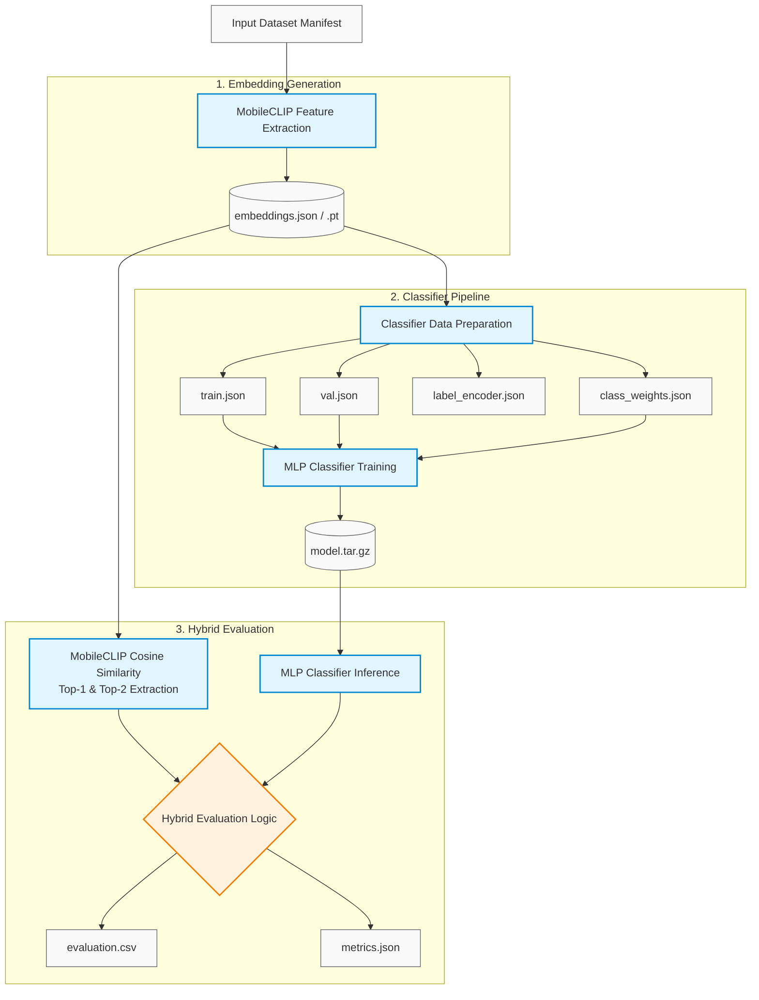
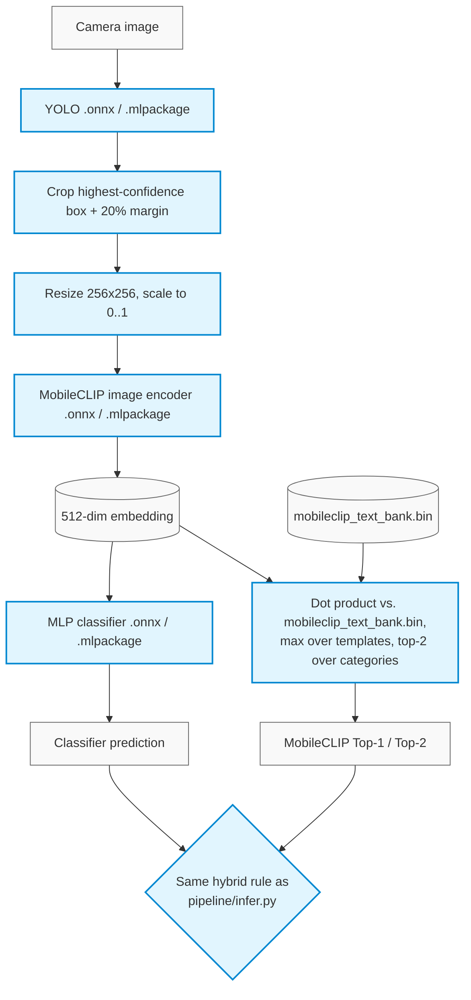

# FOD Pipeline

Foreign Object Debris (FOD) recognition pipeline built around YOLO, MobileCLIP,
and an MLP classifier. The pipeline is designed to run on AWS SageMaker using data stored in Amazon S3,
while also supporting single-image inference locally.

## Architecture

1. **Object Detection** - YOLO locates the foreign object and crops it with a 20% margin.
2. **Embedding Extraction** - MobileCLIP converts the cropped image into a 512-dimensional embedding. (Run once).
3. **MobileCLIP prediction** - The embedding is compared against text prompts to produce the Top-1 and Top-2 predictions.
4. **Classifier prediction** - The same embedding is passed through a trained MLP classifier.
5. **Hybrid prediction** - Combines MobileCLIP Top-1, MobileCLIP Top-2, and the MLP classifier prediction.

## Repository Structure

| Package | Purpose |
| :--- | :--- |
| `src/fod_pipeline/core/` | YOLO detection, MobileCLIP embedding, S3 utilities, label mapping |
| `src/fod_pipeline/data/` | FOD categories and MobileCLIP prompts |
| `src/fod_pipeline/classifier/` | MLP model, data preparation, training |
| `src/fod_pipeline/hybrid/` | Hybrid evaluation metrics |
| `src/fod_pipeline/pipeline/` | Pipeline orchestration |
| `src/fod_pipeline/sagemaker/` | SageMaker job launchers |
| `src/fod_pipeline/mobile/` | On-device export: converts YOLO/MobileCLIP/classifier to ONNX (Android) and Core ML (iOS) |

## Data Pipeline


## Installation

> **Prerequisites:** Python `>= 3.10`

### Step 1 — Clone the Repository

```bash
git clone https://github.com/TalaChehade4/fod-pipeline.git
cd fod-pipeline
```

### Step 2 — Install sagemaker version

```bash
pip install -e ".[sagemaker]"
```

## AWS Configuration

### Step 1 — Create the environment file

Copy `.env.example` to `.env` before using S3 utilities (`core/s3_io.py`) or launching SageMaker jobs (`sagemaker/`):

```bash
cp .env.example .env
```
### Step 2 — Configure environment variables

Open `.env` and set your AWS resources:
```bash
AWS_REGION=your-aws-region
SAGEMAKER_ROLE_ARN=arn:aws:iam::123456789012:role/service-role/AmazonSageMaker-ExecutionRole
S3_BUCKET=your-s3-bucket-name
S3_PROJECT_PREFIX=your-project-prefix
```
**Note:** These variables are loaded automatically across the pipeline. You only need to pass an explicit path flag if you want to override a default S3 location.

## Running the Pipeline on SageMaker
The complete pipeline is intended to run on AWS SageMaker.

### Step 1 — Upload model weights
> **Note:** This step only needs to be run **once** before launching training or evaluation pipelines.
They are currently saved at `s3://oreyeon-models/Tala-temp/fod-pipeline/weights/`.

```bash
fod-upload yolo_model.tar.gz --kind yolo-weights
fod-upload mobileclip_s0.pt --kind mobileclip-weights
```

### Step 2 — Upload datasets

> **Note:** This step only needs to be run **once** before launching training or evaluation pipelines.
Upload the required dataset manifests, database files, and join mappings used to construct the ground truth for MobileCLIP embeddings and the MLP classifier. They are currently saved at `s3://oreyeon-models/Tala-temp/fod-pipeline/manifests/`.

```bash
# --- 1. Dataset Manifests ---
# Saved automatically as 'train_manifest.json' (Classifier training data)
fod-upload train_manifest.manifest --kind manifest --split train

# Saved automatically as 'test_manifest.json' (MobileCLIP & classifier evaluation data)
fod-upload test_manifest.manifest --kind manifest --split test

# --- 2. Database CSVs ---
# Saved automatically as 'trainingdata_old.csv' (Training FOD IDs & labels of the database)
fod-upload trainingdata_old.csv --kind database-csv --split train

# Saved automatically as 'testingdata_old.csv' (Testing FOD IDs & labels of the database)
fod-upload testingdata_old.csv --kind database-csv --split test

# Saved automatically as 'join_config.json' (Classes mapping for classifier only)
fod-upload join_config.json --kind join-config

# --- 3. MobileCLIP Mapping ---
# Saved automatically as 'mobileclip_category_mapping.json' (Maps MobileCLIP FOD categories to database class labels for alignment and accuracy evaluation)
fod-upload mobileclip_category_mapping.json --kind mobileclip-mapping
```

### Step 3 — Build label maps

> **Note:** This step only needs to be run **once** before launching training or evaluation pipelines.
Generate the required ground-truth label maps. They are currently saved at `s3://oreyeon-models/Tala-temp/fod-pipeline/manifests/`.

```bash
# Classifier ground truth (train split) - join-config checked first, database fallback. Saved automatically as `train_label_map.json`
fod-build-label-map --split train --ground-truth classifier

# Classifier ground truth (test split). Saved automatically as `test_label_map.json`
fod-build-label-map --split test --ground-truth classifier

# MobileCLIP ground truth (test split) - database only, no join-config. Saved automatically as `test_mobileclip_label_map.json`
fod-build-label-map --split test --ground-truth mobileclip
```

### Step 4 — Extract embeddings

> **Note:** This step only needs to be run **once** before launching training or evaluation pipelines unless new training or testing data is provided.
Generate MobileCLIP embeddings for the training and testing image datasets. Extracted embeddings are automatically saved in S3 at `s3://oreyeon-models/Tala-temp/fod-pipeline/embeddings/`.

```bash
# Extract embeddings for the training set
fod-sm-embed --split train

# Extract embeddings for the testing set
fod-sm-embed --split test
```

### Step 5 — Prepare classifier data

> **Note:** This step only needs to be run **once** before launching training or evaluation pipelines unless new training or testing data is provided or new classes were added.
Preprocesses the extracted embeddings to generate the following core artifacts: 

* **Train / Validation Split:** Randomly shuffles the training embeddings and splits them into **90% train** and **10% validation** sets (`train` and `val` embedding files).
* **Label Encoder:** Maps each FOD class label to a unique numerical index.
* **Class Weights:** Computes class distribution weights to handle class imbalance during loss calculation (weighted cross-entropy).

Saved automatically in S3 at `s3://oreyeon-models/Tala-temp/fod-pipeline/classifier-data/`.
```bash
fod-sm-prepare
```

### Step 6 — Train the classifier

```bash
fod-sm-train --epochs 100
```
After training, the latest model is automatically copied to `classifier-models/model.tar.gz` while previous training runs remain available under `classifier-results/<job-name>/`

### Step 7 — Evaluate the hybrid pipeline
Results are written to `s3://oreyeon-models/Tala-temp/fod-pipeline/hybrid-results/`.

The hybrid evaluation pipeline combines fine-grained predictions from **MobileCLIP** with broader predictions from the **MLP Classifier**.
Predictions are evaluated hierarchically across 3 levels to balance fine-grained precision with coarse-category fallback accuracy.

---

#### Evaluation Rules & Matching Logic

A prediction is evaluated in order and marked **CORRECT** if it satisfies any of the following conditions:

1. **MobileCLIP Fine Match:** MobileCLIP’s **Top-1** or **Top-2** prediction matches the fine-grained **MobileCLIP Ground Truth** *(e.g., predicted `Allen Key` = actual `Allen Key`)*.
2. **MobileCLIP Coarse Match:** MobileCLIP’s **Top-1** or **Top-2** prediction matches the broader **Classifier Ground Truth** *(e.g., MobileCLIP predicted `Metal Rod` for an `Allen Key` image)*.
3. **MLP Classifier Match:** The **MLP Classifier** output matches the broader **Classifier Ground Truth** *(e.g., the classifier predicted `Metal Rod` for an `Allen Key` image)*.

> **Why this 3-tier system works:**
> 
> MobileCLIP supports specific object categories (like *Allen Key*), whereas the MLP Classifier operates on broader groups (like *Metal Rod*). 
> 
> * **Preserving Precision:** If MobileCLIP successfully predicts *Allen Key*, we capture the specific label.
> * **Rewarding General Accuracy:** If MobileCLIP fails to predict *Allen Key* specifically but predicts *Metal Rod*, or if MobileCLIP misses completely but the MLP Classifier catches *Metal Rod*, we still count the prediction as **correct** because a general match is far better than a total misclassification.

---

#### Decision Flow

```text
Is MobileCLIP Top-1 or Top-2 == MobileCLIP Ground Truth?
 ├── YES ──> Mark as CORRECT (Fine-grained MobileCLIP match)
 └── NO
      └── Is MobileCLIP Top-1 or Top-2 == Classifier Ground Truth?
           ├── YES ──> Mark as CORRECT (Coarse MobileCLIP match)
           └── NO
                └── Is Classifier Output == Classifier Ground Truth?
                     ├── YES ──> Mark as CORRECT (Classifier match)
                     └── NO  ──> Mark as INCORRECT
```

```bash
fod-sm-evaluate
```
## Local Inference

Although training and evaluation are intended to run on SageMaker, inference can run locally on a single image.

```bash
fod-infer path/to/image.png --yolo best.pt --mobileclip mobileclip_s0.pt --classifier-weights model.pth --label-encoder label_encoder.json
```

## Mobile Model Conversion (Android / iOS)

Once the YOLO detector, MobileCLIP model, and MLP classifier are trained, they can be converted into mobile-friendly formats for standalone deployment on Android and iOS. The exported models preserve the complete hybrid inference pipeline locally, allowing high-performance on-device execution with zero server communication required.

### Supported Export Formats

| Platform | Format |
| :--- | :--- |
| **Android** | `ONNX` |
| **iOS** | `Core ML` |

### Prerequisites

| File | Description | Location |
| :--- | :--- | :--- |
| `best.pt` | Trained YOLO detector | s3://oreyeon-models/Tala-temp/fod-pipeline/weights/yolo/model.tar.gz|
| `mobileclip_s0.pt` | MobileCLIP checkpoint | s3://oreyeon-models/Tala-temp/fod-pipeline/weights/mobileclip/mobileclip_s0.pt|
| `model.pth` | Trained MLP classifier | s3://oreyeon-models/Tala-temp/fod-pipeline/classifier-models/model.tar.gz|
| `label_encoder.json` | Class label mapping | s3://oreyeon-models/Tala-temp/fod-pipeline/classifier-data/label_encoder.json|

### Installation

Conversion runs **locally**, against the same weight files already used for local inference.

#### Step 1 – Install the mobile dependencies

```bash
pip install -e ".[mobile]"
```
#### Step 2 – Export all models (Works on Mac Only)

```bash
fod-export-mobile --yolo best.pt --mobileclip mobileclip_s0.pt --classifier-weights model.pth --label-encoder label_encoder.json --output-dir mobile_models
```
By default, this exports both Android (ONNX) and iOS (Core ML) models. To export for a specific platform only, use the --formats flag:

##### Android only

```bash
--formats onnx
```

##### iOS only (Works on Mac Only)

```bash
--formats coreml
```

#### Step 3 – Export individual models (optional)

If only one model has changed, you can export it independently.

```bash
fod-export-yolo        --weights best.pt              --output-dir mobile_models
fod-export-mobileclip  --weights mobileclip_s0.pt      --output-dir mobile_models
fod-export-classifier  --weights model.pth --label-encoder label_encoder.json --output-dir mobile_models
```

#### Step 4 – Generated files

After the export completes, the following directory structure is created:

```text
mobile_models/
├── android/
│   ├── yolo_fod.onnx
│   ├── mobileclip_image_encoder.onnx
│   ├── mobileclip_text_bank.bin
│   ├── mobileclip_text_bank.json
│   ├── fod_classifier.onnx
│   └── classifier_labels.json
└── ios/
    ├── YoloFOD.mlpackage
    ├── MobileClipImageEncoder.mlpackage
    ├── mobileclip_text_bank.bin
    ├── mobileclip_text_bank.json
    ├── FODClassifier.mlpackage
    └── classifier_labels.json
```

#### Step 5 – Add the exported models to your application

Copy the generated files into your mobile project.

Drop `mobile_models/android/*` into your Android project's `app/src/main/assets/`, or
`mobile_models/ios/*` into your Xcode project (drag the `.mlpackage`/`.mlmodel` files in
directly - Xcode generates a Swift class for each one automatically, for either format).

### Model Conversion Details

| Model | Format Outputs | Highlights & Requirements |
| :--- | :--- | :--- |
| **YOLO Detector** | `.onnx`<br>`.mlpackage` | • Exported via `ultralytics`<br>• NMS is baked directly into the graph (`nms=True`) |
| **MobileCLIP Image Encoder** | `.onnx`<br>`.mlpackage` | • **Input:** `256×256` RGB image scaled to `[0, 1]`<br>• **Preprocessing:** Simple Resize + `ToTensor()` (no mean/std normalization)<br>• **Output:** 512-dim, L2-normalized embedding (matches `encode_image(..., normalize=True)`) |
| **MobileCLIP Text Encoder** | *Skipped* | • Precomputed instead of converted (see details below) |
| **MLP Classifier** | `.onnx`<br>`.mlpackage` | • Softmax is baked into the export<br>• Model outputs final class probabilities (not raw logits) |

**Why the text encoder isn't converted:** MobileCLIP classifies an image by comparing its
embedding against text embeddings of the fixed prompts in
`src/fod_pipeline/data/mobileclip_prompts.json` (82 categories × 8 templates). Since that
prompt list is fixed at build time, there's no reason to run a full text transformer on a
phone just to recompute the same numbers every time. Instead, `fod-export-mobileclip`
computes all 82×8 embeddings **once**, on your machine, and writes them out as a small
(~1.3 MB) binary file:

* `mobileclip_text_bank.bin` — raw `float32`, row-major, shape `(num_categories, num_templates, 512)`
* `mobileclip_text_bank.json` — the `categories`/`templates` lists and the shape above, so the app knows how to interpret the raw floats

The phone's job then becomes a plain dot-product + top-k, no ML runtime involved.


> On **Windows**: every `ios/*.mlpackage` above is written as `ios/*.mlmodel` instead (older
> Core ML format - `coremltools` falls back to it automatically and prints a warning
> explaining why. Run on macOS/Linux to get `.mlpackage` instead. 
> The `android/*.onnx` files are unaffected - ONNX export has no platform-specific
> behavior.

### On-device inference flow



## Tests

```bash
pytest
```

